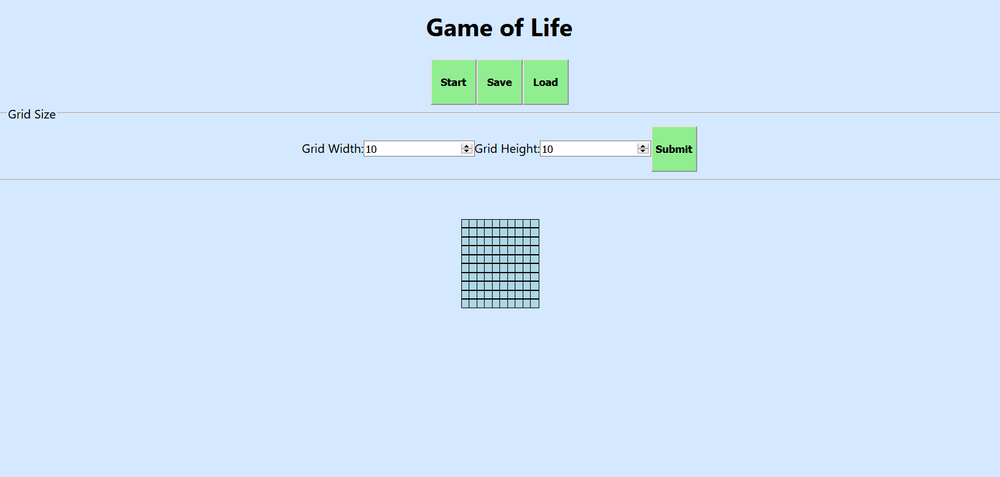
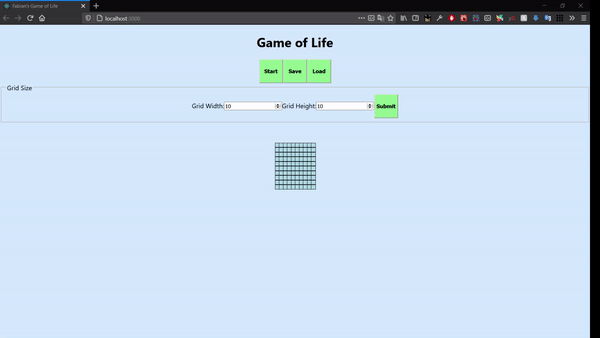

# Game of Life

A small simulation to showcase the John Conway's "Game of Life."

Technologies used to build this:
- React Hooks
- CSS
- Web Audio API
- Axios
- Immer






[Backend Repo Here](https://github.com/Fihra/Game-Of-Life-Backend)

Built by Fabian Fabro.

Instructions to run program:
1. Clone Project or Fork Project: git clone https://github.com/Fihra/Game-of-Life
2. Move inside folder in directory: cd '/Game-Of-Life'
3. npm install
4. npm start

May have to install MongoDB to run your own server.
Download here: https://www.mongodb.com/

Instructions to run program:
1. Clone Project or Fork Project: git clone https://github.com/Fihra/Game-Of-Life-Backend
2. Move inside folder in directory: cd '/Game-Of-Life-Backend'
3. npm install
4. Open MongoDB program (MongoDB Compass Community) & start a new local host connection (mines defaults to localhost, port 27017)
5. Create Database called "GridsDB" with a collection named "grids"
----
6. In "grids" collection, click Insert Document
7. Copy the following lines for the key-value entry:
   ```{
    gridWidth: 10,
    gridHeight: 10,
    myGrid: "0-0-0-0-0-0-0-0-0-0|0-0-0-0-0-0-0-0-0-0|0-0-0-0-0-0-0-0-0-0|0-0-0-0-0-0-0-0-0-0|0-0-0-0-0-0-0-0-0-0|0-0-0-0-0-0-0-0-0-0|0-0-0-0-0-0-0-0-0-0|0-0-0-0-0-0-0-0-0-0|0-0-0-0-0-0-0-0-0-0|0-0-0-0-0-0-0-0-0-0"
   }
8. Click Insert
9. Click the Refresh button (Next to where it says "Displaying documents 1-n of n")
---- 
(Steps 6-9 This generates the starting default grid)\
10. npm start (this should also connect to the database when you have started the connection on MongoDB)

